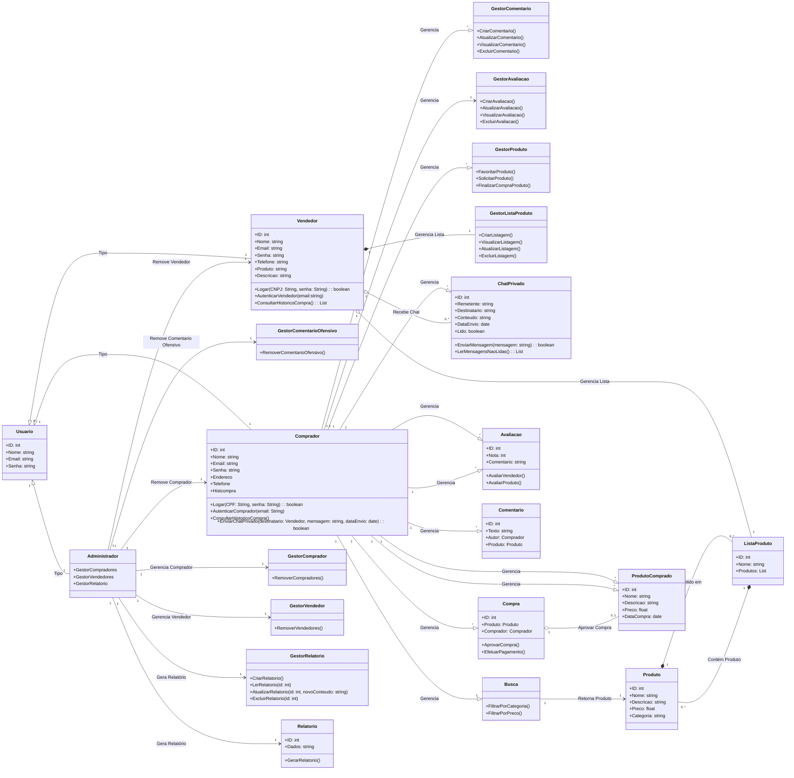
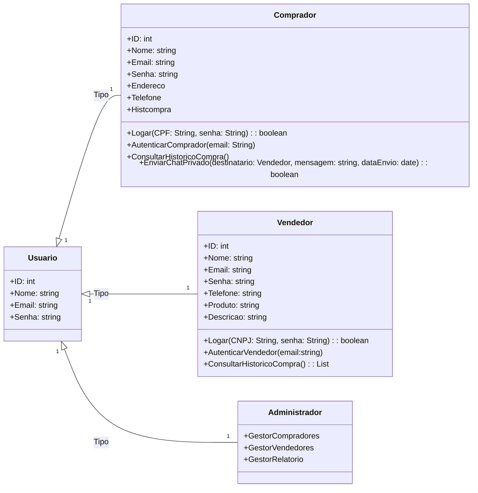
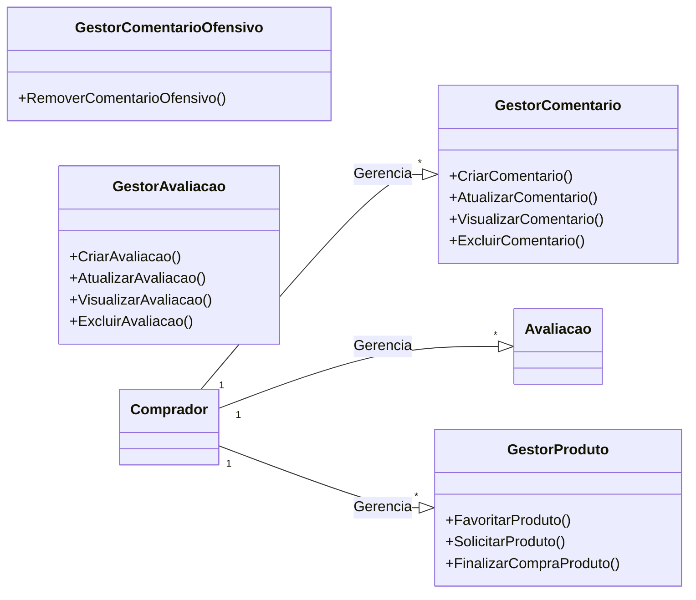
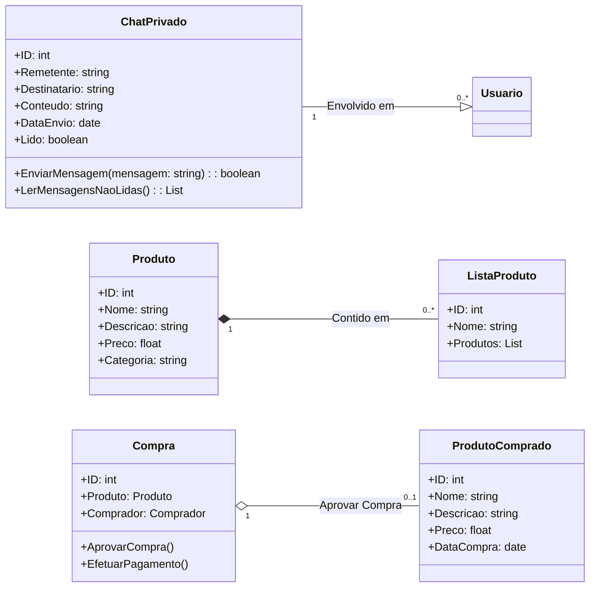
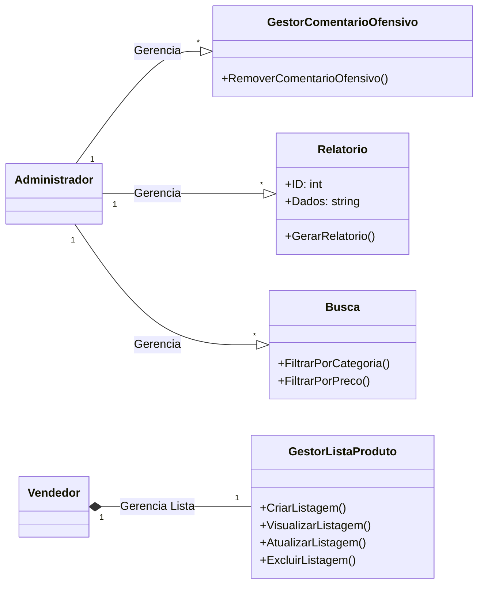

# Projeto-eLearning-Atualizado
Sistema de venda de materiais educacionais digitais
### Laboratório de Engenharia de Software
## Diagrama de Classes Completo

## Diagrama de Classes Dividido

### Diagrama 1: Usuário, Comprador, Vendedor, Administrador

### Diagrama 2: GestorComentario, GestorComentarioOfensivo, GestorAvaliacao, GestorProduto

### Diagrama 3: ChatPrivado, Produto, ProdutoComprado, ListaProduto, Compra

### Diagrama 4: Comentário, Relatório, Busca, GestorListaProduto

